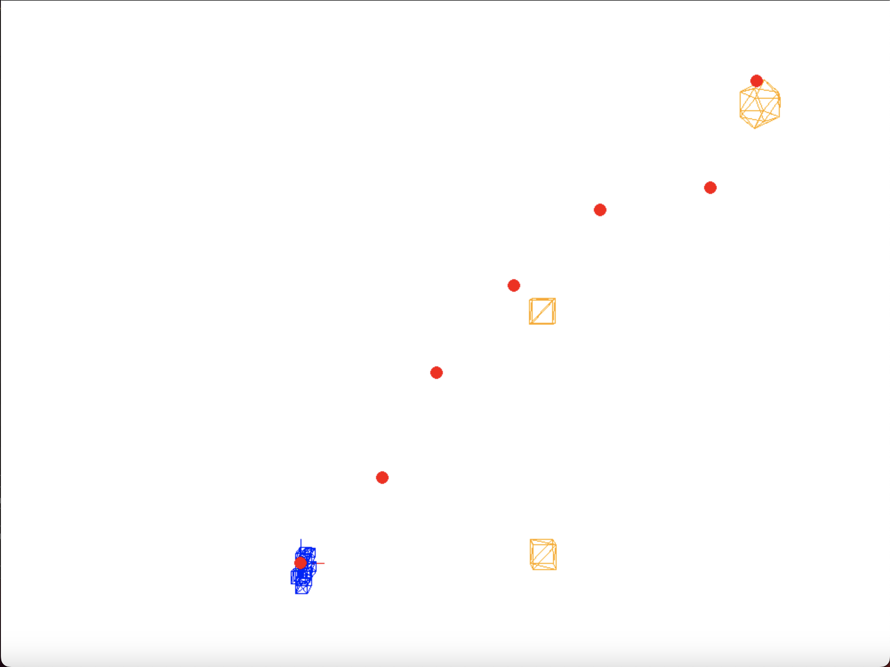
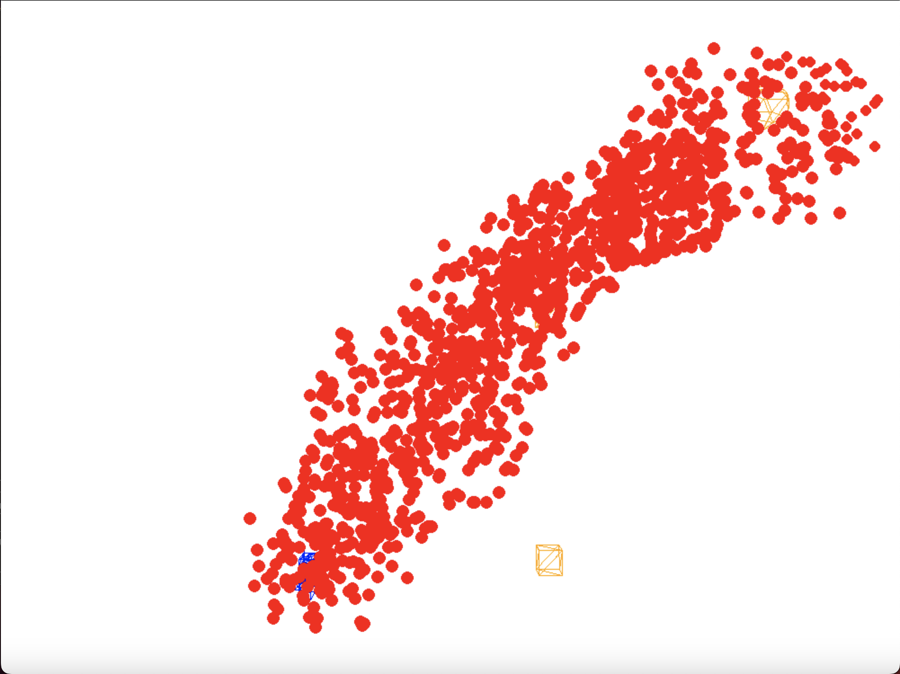
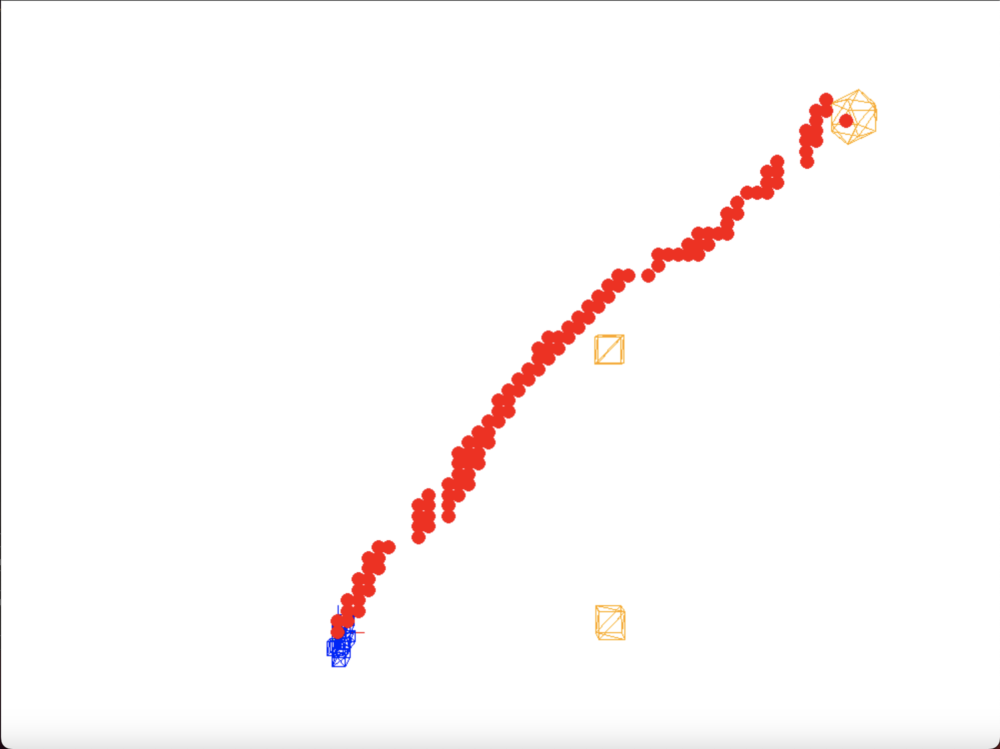
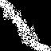
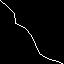

# Planing path algo
___
This project is about optimizing path planing path algorithms for agent in 3D space.
___
##### Usage Example:
``python3  main.py -c diffusion_3D.json -m denoise_model_002 -a rrt test
``
<br> press <code>1</code> to show path found by RRT algorithm
<p align="center">
  
</p>
<br> press <code>2</code> to show noised path
<p align="center">
  
</p>
<br> press <code>3</code> to show denoised path by pre-trained model
<p align="center">
  
</p>

##### Create own map
+ How to add own models: Just add file to models3D folder, it must be .obj file and model must be composed from triangles.
+ Set custom map: It must be writen in json file, and located in "configurations folder"
__example:__
<br>
```json 
//example.json
{
  //name_of_uour_model.obj, [[possition_xyz], [orientation_rotX_rotY_rotZ]]
  "robot": ["robot.obj", [[0.0,0.0,0.0], [-1.5707963267948966,0.0,0.0]]],
  //name_of_obstacles.obj [[[possition_1], [orientation_1]], ... [[possition_i], [[orientation_i]]]
  "obstacles": ["cube.obj",
    [[[10.0, 0.0, 0.0], [0.0,0.0,0.0]],
    [[10.0, 0.0, 10.0], [0.0,0.0,0.0]]]],
  //name_of_goal.obj, [[possition_xyz], [orientation_rotX_rotY_rotZ]]
  "goal": ["goal.obj",[[20.0, 0.0, 20.0], [0.0,0.0,0.0]]]
}
```

##### Create own model for denoising

+ You can use crated datasets in folder ``./dataset``

<br>

__example:__ ``./denoise_simple``

<p align="center">
  
  
</p>

+ You have to add your pre-trained TF model to ``./pretrained_models``

##### There are implemented
+ 3D engine and parser for .obj files
+ SO3 space
+ Rapidly Exploring Random Tree algorithm
+ TF model for denoising path